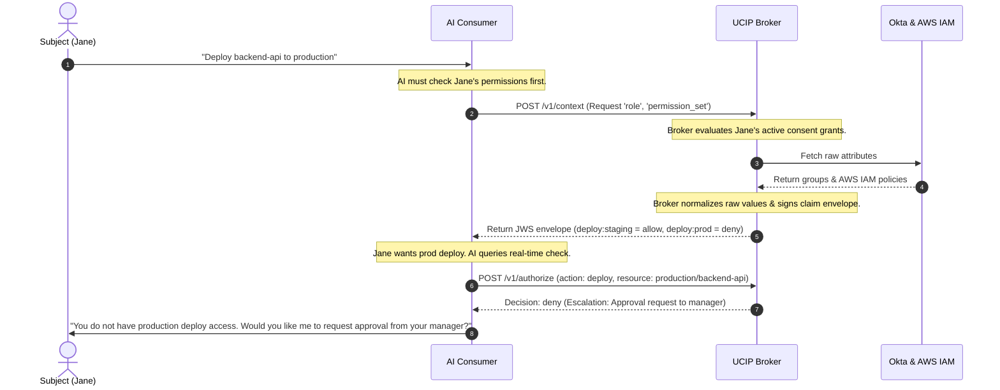
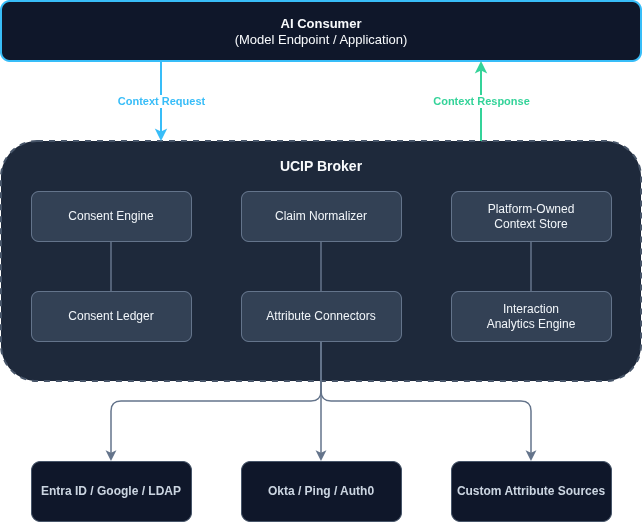

## UCIP: User Context & Identity Protocol

I've been meaning to write about this for a while, I've been consumed by the AI wave and trying to learn about them and make opinions on where they fit best. Playing around with Opus 4.6 when it came out, I managed to come out with something kinda cool.

It didn't start as "let's design an identity protocol for AI systems." It started as a test. I wanted to throw something genuinely hard at Opus 4.6 — not a leetcode problem, but a real systems-design mess. Auth, consent, crypto, derived data, the kind of thing where corners are really easy to cut and really obvious once you've cut them. "Don't log PII" and "sign every claim set" aren't subtle requirements — either the model respects them or it doesn't, and you find out fast.

The problem I picked was one that's been nagging at me anyway: AI systems are increasingly going to need *context* about the people they're talking to — what role someone has, what they're allowed to do, what tier they're on, how technical they are. But all of that lives scattered across a pile of identity providers, none of which were built with "an LLM is going to read this and change its behavior" in mind. Entra ID knows your role. Okta knows your groups. Stripe knows your plan. None of them have any concept of consent for *this* — and honestly, why would they, this use case barely existed a year ago.

And if I'm being honest, this solution will probably make  o sense or it might be completely impractical by the time its done.

Anyway. I expected to get back a toy. A little mock broker, a couple of fake endpoints, something I'd poke at for an afternoon and then forget about. What I actually got back was a full draft protocol spec.

## a handful of bits I keep thinking about

The big picture stuff — broker in the middle, connectors fanning out to IdPs, normalize everything into one schema — is the part that *looks* impressive but honestly isn't that novel if you've spent time around enterprise identity. What I keep coming back to are some smaller choices buried in the spec, the kind that are easy to skip and usually decide whether something is actually usable or just looks nice in a diagram.

One I really like is that every claim request has to carry a *reason*. Not just "give me the user's role," but a `purpose` and a `justification` — and the broker is supposed to actually weigh whether that justification makes sense, and offer a less sensitive claim if one would do the job just as well. The spec's example is rejecting a request for someone's whole interaction history and handing back a coarse "competence level" instead. It's such a small addition to the request shape, but it's the difference between "give me everything, I might need it" and a broker that can actually say "no, but here's something that'll work."

And then there's the section on what the platform itself is allowed to *know* about you — the derived stuff, competence profiles, trust scores. This was honestly the part that made me trust the rest of the spec. There's a whole pipeline diagram: raw interaction metadata → anonymizer → aggregator → store, and the anonymizer's entire job is to make sure the aggregator never sees actual conversation content, just topic categories and complexity signals. It's the kind of rule that's trivial to write down and *so* easy to quietly break six months in when someone needs "just one more field." Having it spelled out as a hard line from day one felt important. Obviously any good planner knows that things will change and its left room for things that change, future decision making planning and all the good preemptive problem solving techniques.

## where it's at now

UCIP's still pre-1.0, and there's a lot left to actually pressure-test — especially the webhook/event side and how revocation actually propagates in practice once there are multiple consumers in play. But it's not "the test project" anymore, at least not in my head. It's a protocol with a real problem behind it, and as far as I can tell nobody else is really solving this yet — giving AI systems context about users in a way that's consent-based, minimal, and auditable from the ground up.

Okay, now most of the base of the project was written using Claude Code with a combo of Opus and Sonnet versions but I'll be implementing some of the more advanced features fairly soon. 

Still rough in spots — which feels about right, honestly, for something that started as a test.

Keep watch on my github for when the project goes public.

